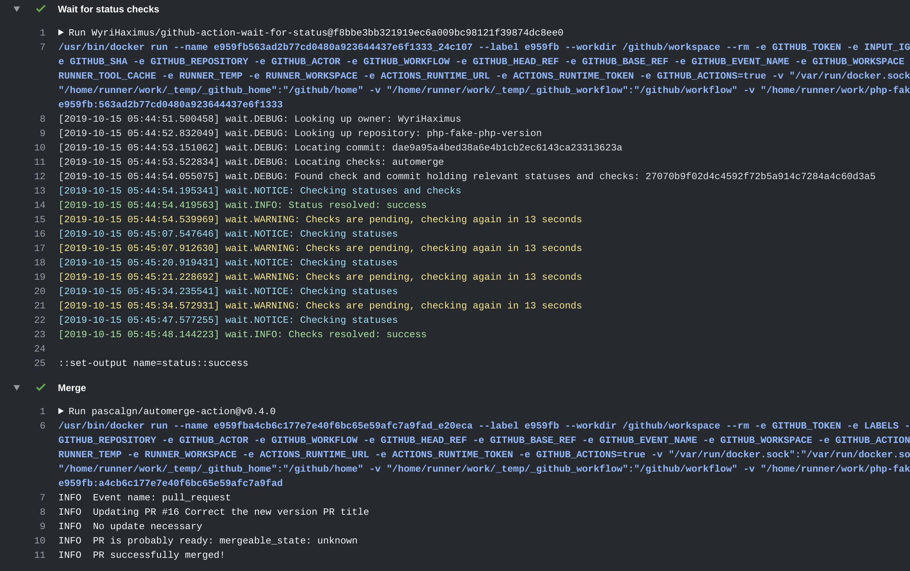

# github-action-wait-for-status

GitHub Action that waits for successful commit statuses and checks.



This actions main goal is to wait until all statuses and checks are successful or any of them has failed and set its 
status output accordingly.

## Options

This action supports the following options.

### ignoreActions

List of actions to ignore the status from, mainly to exclude the action this action is used in preventing it from waiting forever.

* *Required*: `Yes`
* *Type*: `CSV`
* *Example*: `automerge,otheraction` but a single action is also perfectly valid `automerge`

### ignoreContexts

List of contexts to ignore the status from, mainly to exclude external checks.

* *Required*: `No`
* *Type*: `CSV`
* *Example*: `coverage/coveralls,ci/circleci: build` but a single action is also perfectly valid `coverage/coveralls`

### checkInterval

The amount of seconds to wait between checks, adjust depending on the expected time all the checks and related CI's will take.

* *Required*: `No`
* *Type*: `Integer`
* *Default*: `10`
* *Example*: `60` for longer running jobs, or `5` for very short jobs.

## Output

This action has only one output and that's the `status` output. It has two possible values:

* `success` when all statuses and checks have a successful outcome.
* `failure` when any status or check has failed, even though other checks might still be running.
* `error` when an error occurs, log output will include the response body.
* `rate_limited` when the API calls this action makes are rate limited.

As shown in the example below the `status` output can be used to skip any follow up steps in the action if conditions aren't met.

*Note*, that this action always has exit code `0` unless something fails, that's because it's indifferent about your 
state of your statuses and checks and leave what to do up to you.

## Example

The following example is taken from the `PHP` package [`wyrihaximus/fake-php-version`](https://github.com/wyrihaximus/php-fake-php-version/)  
where any PR with the `automerge` label will be automatically merged using [`pascalgn/automerge-action`](https://github.com/marketplace/actions/merge-pull-requests).
The output of an action can be seen [here](https://github.com/WyriHaximus/php-fake-php-version/commit/0de3b06ee111ccc8b600219b95cebe4b434bef63/checks?check_suite_id=263513218).
But in order to ensure we don't merge a failing PR we use this action to ensure everything is green before merging it.
If anything fails we won't merge the PR and wait for the next update and try again.

```yaml
name: Auto Merge
on:
  pull_request:
    types:
      - labeled
      - unlabeled
      - synchronize
      - opened
      - edited
      - ready_for_review
      - reopened
      - unlocked
  pull_request_review:
    types:
      - submitted
  status: {}
jobs:
  automerge:
    runs-on: ubuntu-latest
    steps:
      - name: 'Wait for status checks'
        id: waitforstatuschecks
        uses: "WyriHaximus/github-action-wait-for-status@v2"
        with:
          ignoreActions: automerge
          checkInterval: 13
        env:
          GITHUB_TOKEN: "${{ secrets.GITHUB_TOKEN }}"
      - name: 'Merge'
        uses: "pascalgn/automerge-action@v0.4.0"
        if: steps.waitforstatuschecks.outputs.status == 'success'
        env:
          GITHUB_TOKEN: "${{ secrets.GITHUB_TOKEN }}"
          LABELS: automerge
```

## License ##

Copyright 2020 [Cees-Jan Kiewiet](http://wyrihaximus.net/)

Permission is hereby granted, free of charge, to any person
obtaining a copy of this software and associated documentation
files (the "Software"), to deal in the Software without
restriction, including without limitation the rights to use,
copy, modify, merge, publish, distribute, sublicense, and/or sell
copies of the Software, and to permit persons to whom the
Software is furnished to do so, subject to the following
conditions:

The above copyright notice and this permission notice shall be
included in all copies or substantial portions of the Software.

THE SOFTWARE IS PROVIDED "AS IS", WITHOUT WARRANTY OF ANY KIND,
EXPRESS OR IMPLIED, INCLUDING BUT NOT LIMITED TO THE WARRANTIES
OF MERCHANTABILITY, FITNESS FOR A PARTICULAR PURPOSE AND
NONINFRINGEMENT. IN NO EVENT SHALL THE AUTHORS OR COPYRIGHT
HOLDERS BE LIABLE FOR ANY CLAIM, DAMAGES OR OTHER LIABILITY,
WHETHER IN AN ACTION OF CONTRACT, TORT OR OTHERWISE, ARISING
FROM, OUT OF OR IN CONNECTION WITH THE SOFTWARE OR THE USE OR
OTHER DEALINGS IN THE SOFTWARE.
